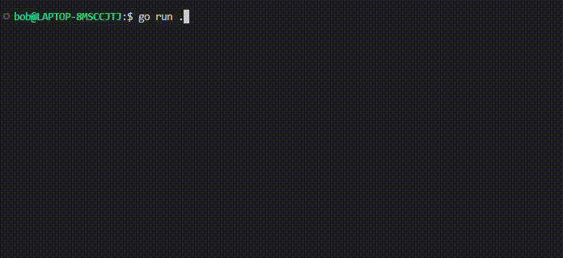

# go-todoApp

Todo App built with Golang and MySQL

Features :

- Register
- Login
- Insert a new activity
- Show my activities
- Show my profile
- Update password

# Requirement

- Go v1.19
- MySQL v8.x

# Demo App



# How to run

Clone it

```
git clone https://github.com/hebobibun/go-todoApp.git
```

Go to directory

```
cd go-todoApp
```

Run the project

```
go run .
```

# Enjoy

Keep learning! ^^
